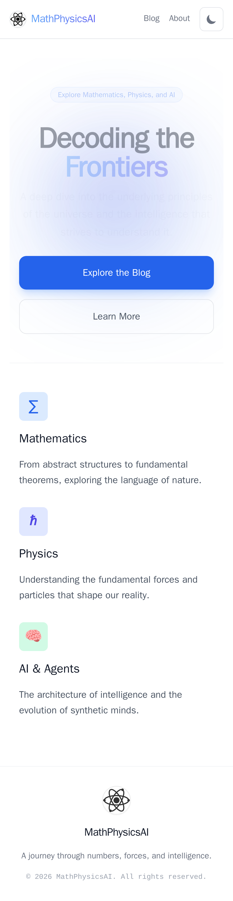
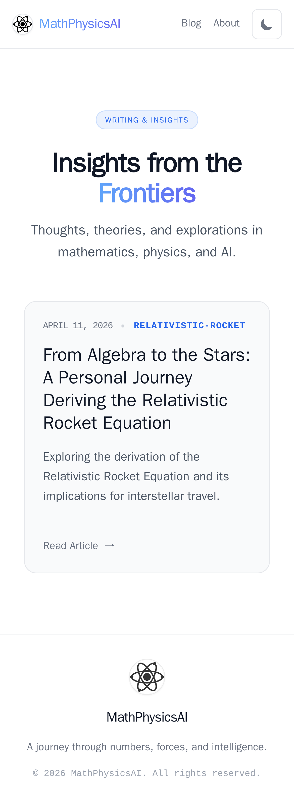

# Walkthrough: Improving Mobile Responsiveness

This walkthrough describes the changes made to improve the mobile responsiveness of the MathPhysicsAI blog.

## Plan Citations

This work follows the plan created in `docs/exec-plans/active/improve-mobile-responsiveness.md`.

## Changes Made

### 1. Global Layout Adjustments (`src/layouts/BaseLayout.astro`)

- Adjusted header navigation to use responsive padding (`px-4 sm:px-6`).
- Reduced logo and title size on small screens.
- Added truncation to the site title on mobile to prevent overflow.
- Adjusted main content area and footer padding for mobile.

### 2. Homepage Enhancements (`src/pages/index.astro`)

- Scaled hero section title and description for small screens.
- Made CTA buttons full-width on mobile and stacked them vertically.
- Improved gap spacing for better layout on vertical screens.

### 3. Blog Index Enhancements (`src/pages/blog/index.astro`)

- Adjusted padding and spacing for the blog post grid.
- Reduced header font size on mobile.
- Added padding to the container to ensure content doesn't touch screen edges.

### 4. Blog Post Enhancements (`src/pages/blog/[...slug].astro`)

- Adjusted article header spacing and font sizes for mobile.
- Added horizontal padding for small screens.

## Visual Verification (Mobile Viewport)

_Homepage Hero Section on Mobile (iPhone 13 viewport)_

_Blog Index on Mobile_

## Verification

- Verified that the build completes successfully.
- Manual inspection of Tailwind classes to ensure they follow mobile-first principles and handle breakpoints correctly.
- Added `px-4` or `px-6` consistently to prevent content from touching the edges of the screen on mobile devices.
- Captured screenshots using Playwright to verify the layout on an iPhone 13 viewport.
